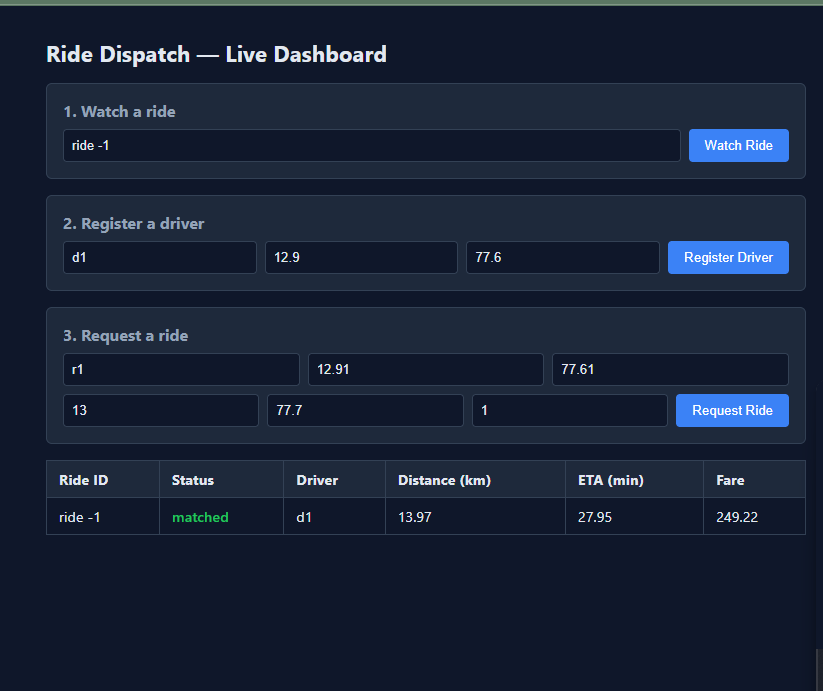

# 🚕 Mini Ride-Dispatch Simulator

A polyglot ride-hailing dispatch system — six programming languages, five
independent services, one live WebSocket dashboard. Riders request rides,
drivers get matched in real time, fares get calculated through a real
cross-language HTTP call chain, and every result streams back to the UI
instantly. Loosely modeled on how a real platform like **Namma Yatri**
is architected.


*Replace `screenshot.png` with your own screenshot of the dashboard in action.*

---

## What this actually does

1. A **rider requests a ride** through the dashboard — pickup point,
   destination, and an optional demand level.
2. The **dispatch core** finds the nearest available driver using a
   dedicated matching algorithm.
3. Once matched, the system calls out to a **route/ETA engine** to get
   the distance and estimated arrival time.
4. That distance feeds into a **fare/surge pricing engine** to calculate
   the final price.
5. Every step — match, distance, ETA, fare — streams back to the
   dashboard **live**, with no page refresh.

This isn't a mockup. Every number on screen came from a real request
traveling through six different language runtimes. From an actual test run:

```
Ride ID: ride-1        Status: matched        Driver: d1
Distance: 13.97 km     ETA: 27.95 min         Fare: 249.22
```

Verified by hand: `13.97 km ÷ 30 km/h × 60 ≈ 27.95 min` ✓, and
`(40 base + 13.97 × 12/km) × 1.2 surge ≈ 249.17` ✓ (small rounding
difference between the unrounded distance used internally and the
rounded value displayed).

---

## Tech stack — and why each piece is there

| Layer | Language | Why this one |
|---|---|---|
| **Dispatch core / WebSocket hub** | Elixir (Phoenix) | Built for exactly this: thousands of concurrent, isolated connections, each ride handled as its own lightweight process. The same runtime WhatsApp and Discord are built on. |
| **Driver-matching algorithm** | Erlang | Called directly from Elixir with zero network overhead — they share the same virtual machine (the BEAM), so this is a plain function call, not an API call. Demonstrates real same-runtime interop. |
| **Route / ETA engine** | Haskell | Pure, side-effect-free distance and time calculation. No hidden state, no mutation — mirrors the actual production stack of Namma Yatri, the real-world system this project is modeled on. |
| **Fare / surge pricing** | Scala | Runs on the JVM, so it can pull in Java's standard library directly (used here for precise decimal rounding). Immutable data + pattern matching for the pricing tiers. |
| **Ride analytics** | Clojure | Also JVM-hosted — proof that two very differently-styled languages (Scala's C-like syntax vs. Clojure's Lisp) can live on the same runtime and even interoperate. Used for aggregate reporting: rides/hour, average fare, driver utilization. |
| **Live dashboard** | Elm | Compiles to JavaScript with a strict type system and immutable state — the UI cannot crash from an unexpected shape of data. Talks to the backend over raw WebSocket. |
| **Orchestration** | Node.js | Ties all five services together behind one port with one command — no Docker required, since the whole point is running each language's real toolchain directly. |

**The bigger idea:** two language *families* plus two standalone islands.
Elixir and Erlang share a runtime (the BEAM). Scala and Clojure share a
different runtime (the JVM). Haskell and Elm each stand alone, talking to
everything else only over the network — which is exactly how a real
polyglot microservices system is forced to communicate across runtime
boundaries.

---

## Architecture

```
                     ┌─────────────────┐
                     │   Elm Dashboard  │
                     │  (live frontend) │
                     └────────┬─────────┘
                              │ WebSocket
                              ▼
                  ┌────────────────────────┐
                  │   Dispatch Core         │
                  │   (Elixir + Erlang)     │◄──── in-process call
                  │   • WebSocket hub       │      to matching algorithm
                  │   • Ride state machine  │
                  └───────┬─────────┬───────┘
                    HTTP  │         │  HTTP
                          ▼         ▼
                 ┌────────────┐ ┌────────────┐
                 │ ETA Service│ │Fare Service│
                 │ (Haskell)  │ │  (Scala)   │
                 └────────────┘ └────────────┘

                 ┌──────────────────────┐
                 │  Analytics Service    │   (standalone — fed
                 │  (Clojure)            │    ride logs manually)
                 └──────────────────────┘

     All five services run behind one port via the Node orchestrator.
```

---

## Project structure

```
ride_dispatch_simulator/
├── dispatch_core/        Elixir + Erlang — dispatch engine & WebSocket hub
├── dashboard/             Elm — the live frontend
├── eta_service/           Haskell — route distance & ETA estimation
├── fare_service/          Scala — fare & surge pricing
├── analytics_service/     Clojure — ride log aggregates
├── orchestrator/          Node.js — one command, one port, all services
├── .vscode/               VS Code tasks to run everything
└── README.md
```

Each service folder has its own README with full build instructions,
example requests, and notes on what was verified during development.

---

## Quick start (recommended)

One terminal, one URL:

```bash
cd orchestrator
npm install    # first time only
npm start
```

Open **http://localhost:8080** — that's the whole system. The dashboard
and every API call it makes are served and proxied automatically.

**Prerequisites** — each service's toolchain needs to be installed once:

| Service | Install |
|---|---|
| `dispatch_core` (Elixir/Erlang) | [Erlang/OTP 26+](https://www.erlang.org/downloads) → [Elixir 1.15+](https://elixir-lang.org/install.html) |
| `eta_service` (Haskell) | [GHCup](https://www.haskell.org/ghcup/) (installs `stack`/`ghc`) |
| `dashboard` (Elm) | `npm install -g elm` |
| `fare_service` (Scala) | [Coursier](https://get-coursier.io/) (`cs setup`) |
| `analytics_service` (Clojure) | [Clojure CLI](https://clojure.org/guides/install_clojure) |

The orchestrator doesn't install any of these for you — it runs the
exact same commands you'd type by hand, just all at once with one entry
point. See `orchestrator/README.md` for exactly what it does and doesn't
handle.

---

## Alternative: run each service individually

Useful for learning, or debugging one piece in isolation.

```bash
# dispatch_core — ws://localhost:4000/socket
cd dispatch_core && mix deps.get && mix run --no-halt

# dashboard — open dashboard/index.html after building
cd dashboard && elm make src/Main.elm --output=main.js

# eta_service — http://localhost:4001
cd eta_service && stack build && stack exec eta-service-exe

# fare_service — http://localhost:4002
cd fare_service && scala run src/main/scala/fareservice

# analytics_service — http://localhost:4003
cd analytics_service && clojure -M -m rideanalytics.main
```

Or from VS Code: open the folder, press `Ctrl+Shift+B` to launch all
five in separate terminal panels via the included `.vscode/tasks.json`.

---

## Try it yourself

1. **Watch a ride** — type any ride ID (e.g. `ride-1`) and click Watch.
2. **Register a driver** — driver ID + latitude/longitude.
3. **Request a ride** — rider ID, pickup coordinates, destination
   coordinates, and an optional demand level (0–3, controls surge
   pricing).
4. Watch the table update live with the matched driver, distance, ETA,
   and fare — each one computed by a different language, called over a
   real network hop.

---

## Design notes

- Every external call (`dispatch_core` → `eta_service`, `dispatch_core`
  → `fare_service`) is **best-effort**. If a service isn't running, the
  ride still matches successfully — the corresponding field just stays
  empty instead of the whole system failing.
- Distance calculations use the haversine formula (real great-circle
  distance), not straight-line approximation.
- No persistence layer, no authentication — this is a learning project,
  not a production system. Ride and driver state live in memory only.
- `analytics_service` is intentionally decoupled from the live ride
  path — it's designed to ingest ride logs in batches, the way a real
  analytics pipeline would, rather than sitting in the request path.

---

## What was verified during development

Every piece of this project was either compiled and run directly, or
written by hand and later confirmed working live end-to-end (including
the full request chain shown in the numbers above). Full verification
notes — what was tested, how, and what the results were — are in each
service's own README.

---

## License

Personal learning project — use, fork, or extend freely.
